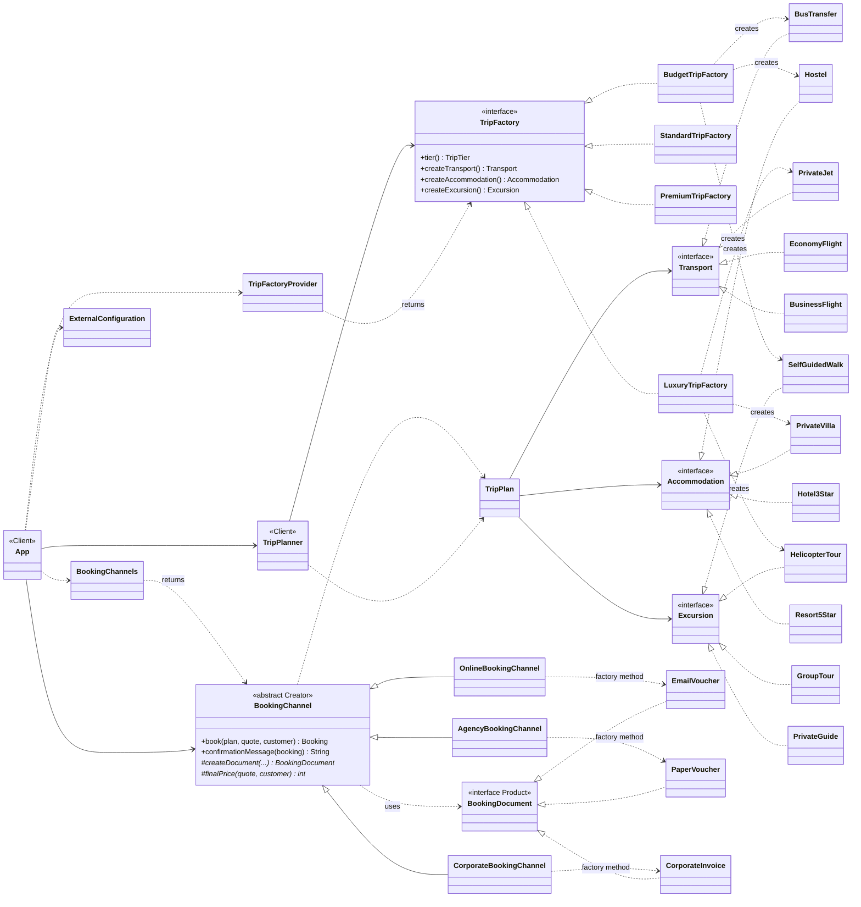

# Trip Factory — Factory Method & Abstract Factory

Assignment 2, Software Design Patterns. Java 17, Maven, JUnit 5.
Domain: trip planning (continues the Travel Package domain of Assignment 1).

## Product families and product types

| Product type ↓ / Family → | BUDGET | STANDARD | PREMIUM | LUXURY *(Part G)* |
|---|---|---|---|---|
| **Transport** | `BusTransfer` | `EconomyFlight` | `BusinessFlight` | `PrivateJet` |
| **Accommodation** | `Hostel` | `Hotel3Star` | `Resort5Star` | `PrivateVilla` |
| **Excursion** | `SelfGuidedWalk` | `GroupTour` | `PrivateGuide` | `HelicopterTour` |

12 concrete products. They differ in behaviour, not only in name: travel time (14 h by bus,
90 min by jet), baggage (10 vs 100 kg), meals (none vs all inclusive), check-in hour,
guide and group size. Those values drive the itinerary, the packing list and the price.

## Run

```bash
./mvnw test                                   # 58 tests
./mvnw package -DskipTests
java -cp target/classes kz.aitu.sdp.trip.app.App --family=PREMIUM --channel=agency --nights=4
```

The family can also come from `TRIP_FAMILY` or from `src/main/resources/trip.properties`.

```
Family selected at runtime: LUXURY, booking channel: Online

Trip to Antalya
  Transport:  Private jet, direct flight
  Stay:       Private villa with a chef and a butler
  Excursion:  Helicopter tour over the coast

Arrival day
  Day 1 08:00  Departure: Private jet, direct flight
  Day 1 09:30  Arrival after 1 h (dropped at the door)
  Day 1 09:30  Check-in: Private villa with a chef and a butler
  Day 1 11:00  Excursion: Helicopter tour over the coast (guide: personal pilot-guide)
  Day 1 13:00  Dinner at the stay (ALL_INCLUSIVE)
```

## The two patterns

**Abstract Factory** builds a consistent family of trip components.

```java
TripFactory factory = TripFactoryProvider.from(configuration);   // chosen at runtime
TripPlan plan = new TripPlanner(factory).planTrip(request);      // one family, always
```

**Factory Method** issues the booking document. `BookingChannel.book()` is the shared
business logic; the subclass decides which document it produces.

```java
public final Booking book(TripPlan plan, Quote quote, Customer customer) {
    requireGroupFits(plan, customer);
    int price = finalPrice(quote, customer);                       // channel rule
    BookingDocument document = createDocument(plan, customer, price, nextReference());
    return new Booking(..., document);
}
```

| Channel | Pricing | Document | Payment |
|---|---|---|---|
| Online | −3 % | e-mail voucher | immediately |
| Agency | +5 % service fee | signed paper voucher | 3 days |
| Corporate | −7 % from 5 travelers | PDF invoice to the company | 30 days |

## How family consistency is guaranteed (Part D)

1. Concrete products are **package-private** next to their factory. Code outside
   `family.budget` cannot even name `Hostel`, so it cannot create one.
2. The only way to obtain a component is a `TripFactory`, and every factory returns
   components of its own tier.
3. `TripPlanner` holds **one** factory and takes all three components from it, so a plan
   cannot contain two families.
4. `TripPlan` verifies the tiers as a safety net for hand-assembled plans; it is the last
   line of defence, not the mechanism.

## Documentation

- [docs/PART-A-PROBLEMS.md](docs/PART-A-PROBLEMS.md) — the version without factories and its problems
- [docs/REPORT.md](docs/REPORT.md) — design report, part by part
- [docs/PART-G-CHANGES.md](docs/PART-G-CHANGES.md) — exactly what changed when the fourth family was added
- [docs/uml/class-diagram.puml](docs/uml/class-diagram.puml) — UML, both patterns marked

## UML



Green half of the PlantUML diagram = **Abstract Factory**, orange half = **Factory Method**.
